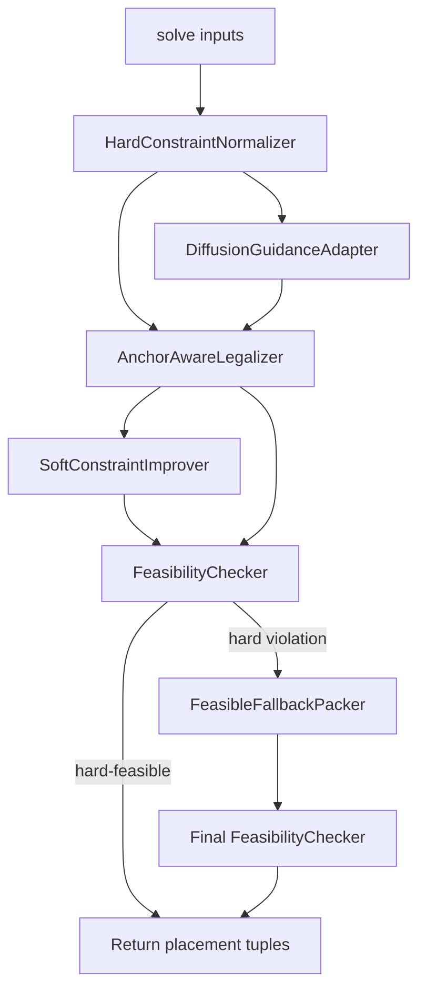

# High-Level Design

## Overview

This design defines a feasibility-first legalization architecture for `my_optimizer.py`, focused on preserving ICCAD 2026 FloorSet hard constraints after the diffusion model produces an initial layout. The optimizer remains compatible with the required `FloorplanOptimizer.solve(...)` API and returns one `(x, y, width, height)` tuple per block.

The core architectural decision is to treat diffusion output as a quality signal, not as proof of legality. Hard feasibility is owned by a deterministic, anchor-aware legalizer and an evaluator-aligned final checker. Preplaced blocks are immutable anchors throughout placement, fixed-shape dimensions are preserved before placement starts, and soft-constraint improvements are attempted only when they preserve hard feasibility.

Source traceability: `doc/proposal.md` sections "Objective", "Current Project State", "Problem Summary", "Proposed Approach", "Algorithm Strategy", and "Module Candidates"; `doc/problem-brief.md` sections "Assignment Objective", "Required Inputs", "Required Outputs", and "Constraints"; `doc/repo-map.md` sections "Main Source Files" and "Missing or Ambiguous Areas"; `doc/quality-gates.md` sections "Integration Test Commands", "Benchmark or Evaluator Commands", and "Recommended Minimum Done Criteria".

## Goals

- Preserve all contest hard constraints before returning a solution from `MyOptimizer.solve(...)`.
- Keep the required optimizer API and output shape unchanged.
- Preserve exact dimensions for fixed-shape and preplaced blocks.
- Preserve exact coordinates and dimensions for preplaced blocks.
- Ensure soft blocks meet the evaluator's area tolerance.
- Prevent overlap by packing all non-preplaced blocks around already placed immutable anchors.
- Use diffusion predictions to improve ordering and candidate preference without allowing them to bypass legality.
- Provide a conservative feasible fallback when the optimized legalizer cannot produce a hard-feasible placement.
- Align final acceptance checks with `iccad2026_evaluate.py` semantics.

## Non-Goals

- Do not change contest data, validation data, or `.pth` dataset files.
- Do not change `iccad2026_evaluate.py` scoring behavior.
- Do not require new dependencies, since no dependency manifest is present locally.
- Do not make grouping, MIB, or boundary constraints hard feasibility constraints.
- Do not redesign the training pipeline or require checkpoints for basic hard-feasible behavior.
- Do not introduce a new storage layer, service boundary, queue, external API, or deployment architecture.

## Requirements Summary

| Requirement | Design Response | Source |
| --- | --- | --- |
| Return one `(x, y, width, height)` tuple per block | Preserve `MyOptimizer.solve(...)` as the externally visible entry point | `doc/proposal.md`: Constraints; `doc/problem-brief.md`: Required Outputs |
| No overlaps | Anchor-aware legalizer and final feasibility checker own non-overlap | `doc/proposal.md`: Problem Summary, Proposed Approach |
| Soft-block area within 1% | Normalize dimensions before placement and verify before return | `doc/proposal.md`: Proposed Approach; `doc/problem-brief.md`: Constraints |
| Fixed-shape dimensions unchanged | Hard constraint normalizer derives immutable dimensions up front | `doc/proposal.md`: Proposed Approach |
| Preplaced position and dimensions unchanged | Preplaced blocks are inserted first as immutable anchors | `doc/proposal.md`: Proposed Approach, Algorithm Strategy |
| Boundary/grouping/MIB are soft | Soft improvements are subordinate to hard feasibility | `doc/proposal.md`: Problem Summary, Correctness Strategy |
| Infeasible case costs `10.0` | Prefer conservative feasible fallback over returning an invalid optimized result | `doc/proposal.md`: Problem Summary, Algorithm Strategy |
| Larger cases matter more | Keep legalizer deterministic and near-quadratic or better for 21-120 blocks | `doc/proposal.md`: Performance Strategy |
| Evaluation commands require approval | HLD does not run evaluator commands; quality gates document approval requirements | `doc/quality-gates.md`: Commands Not Run |

## Proposed Architecture

The optimizer architecture is a single in-process pipeline inside `my_optimizer.py`, with logical modules that may map to functions or classes during detailed design. The pipeline normalizes input constraints, obtains optional diffusion guidance, performs hard-constraint-aware placement, optionally improves soft constraints through checked moves, validates hard feasibility, and falls back to conservative packing when needed.

Architectural decisions:

- Dimension and immutability metadata are established before model output is interpreted.
- Preplaced blocks are represented as occupied rectangles before any movable block is packed.
- Diffusion output can rank movable blocks and candidate locations, but cannot directly overwrite final legal coordinates.
- Boundary moves and other soft improvements are accepted only after legality checks.
- The final returned placement must pass the same hard-constraint categories used by the evaluator.

## Modules

### HardConstraintNormalizer

| Field | Detail |
| --- | --- |
| Responsibility | Convert raw solve inputs into legal block metadata before placement decisions. Identify movable, fixed-shape, and preplaced blocks. Derive exact dimensions for fixed/preplaced blocks and area-preserving dimensions for soft blocks. |
| Inputs | `block_count`, `area_targets`, `constraints`, `target_positions` when available through the existing solve path. |
| Outputs | Block metadata containing dimensions, immutability flags, target preplaced coordinates, area targets, and soft-constraint annotations needed by later stages. |
| Owned data | Normalized in-memory block records for the current solve call. |
| Dependencies | Evaluator constraint semantics as summarized in the proposal and problem brief. |
| Externally visible behavior | No direct external API; affects all returned tuples by defining legal dimensions and immutable anchors. |
| Source traceability | `doc/proposal.md`: Proposed Approach item 1; Module Candidates; `doc/problem-brief.md`: Constraints. |

### DiffusionGuidanceAdapter

| Field | Detail |
| --- | --- |
| Responsibility | Translate model predictions into advisory ordering and placement preferences. It must not own legality. |
| Inputs | Normalized block metadata, connectivity inputs, pins, current model outputs from the existing Edge-GNN plus DiT flow. |
| Outputs | Stable block order, predicted centers or coordinates, and optional candidate preference scores for the legalizer. |
| Owned data | Per-call advisory scores derived from diffusion output. |
| Dependencies | Existing `my_optimizer.py` model components and available checkpoints when present. |
| Externally visible behavior | None directly; improves solution quality when model predictions are useful. |
| Source traceability | `doc/proposal.md`: Current Project State, Proposed Approach item 3, Algorithm Strategy. |

### AnchorAwareLegalizer

| Field | Detail |
| --- | --- |
| Responsibility | Produce a non-overlapping placement by packing movable blocks around preplaced anchors, using diffusion guidance as a preference signal. |
| Inputs | Normalized block metadata, immutable anchor rectangles, connectivity information, diffusion guidance. |
| Outputs | Candidate placement tuples for all blocks. |
| Owned data | Occupied rectangle set, candidate placement list, legalizer scoring state for the current solve call. |
| Dependencies | HardConstraintNormalizer for legal dimensions and anchor metadata; DiffusionGuidanceAdapter for advisory ordering or target positions. |
| Externally visible behavior | Main source of returned coordinates when it produces a hard-feasible solution. |
| Source traceability | `doc/proposal.md`: Proposed Approach item 2, Algorithm Strategy, Correctness Strategy. |

### SoftConstraintImprover

| Field | Detail |
| --- | --- |
| Responsibility | Optionally improve boundary, grouping, and MIB violations through transformations that preserve hard feasibility. |
| Inputs | Candidate legal placement, soft-constraint annotations, connectivity and pin data when needed for scoring tradeoffs. |
| Outputs | Same placement or an improved placement that still passes hard checks. |
| Owned data | Candidate moves and accepted soft-constraint-improvement decisions for the current solve call. |
| Dependencies | FeasibilityChecker for move acceptance; AnchorAwareLegalizer output. |
| Externally visible behavior | Can improve local score but must not make a feasible placement infeasible. |
| Source traceability | `doc/proposal.md`: Proposed Approach item 4, Algorithm Strategy, Module Candidates; `doc/problem-brief.md`: Constraints. |

### FeasibilityChecker

| Field | Detail |
| --- | --- |
| Responsibility | Check hard constraints before returning: overlap, soft-block area tolerance, fixed-shape dimensions, and preplaced coordinates/dimensions. |
| Inputs | Candidate placement tuples, normalized block metadata, original constraints and target positions. |
| Outputs | Hard-feasibility result and violation categories for fallback or diagnostics. |
| Owned data | Per-call validation result. |
| Dependencies | Evaluator-equivalent hard-constraint semantics from `iccad2026_evaluate.py`. |
| Externally visible behavior | Determines whether optimized placement is returned or fallback is invoked. |
| Source traceability | `doc/proposal.md`: Proposed Approach item 5, Correctness Strategy; `doc/quality-gates.md`: Recommended Minimum Done Criteria. |

### FeasibleFallbackPacker

| Field | Detail |
| --- | --- |
| Responsibility | Produce a conservative hard-feasible placement when optimized legalization or soft improvement fails final checks. |
| Inputs | Normalized block metadata and immutable preplaced anchors. Diffusion output may be used only for stable ordering if it cannot compromise feasibility. |
| Outputs | Conservative placement tuples for all blocks. |
| Owned data | Fallback occupied rectangle set and deterministic packing state for the current solve call. |
| Dependencies | HardConstraintNormalizer for legal dimensions; FeasibilityChecker for final acceptance. |
| Externally visible behavior | Prevents returning infeasible layouts even when quality-oriented placement fails. |
| Source traceability | `doc/proposal.md`: Proposed Approach item 5, Algorithm Strategy, Alternatives Considered. |

## Module Relationships

| Type | Source | Target | Direction and Ownership | Data or Contract | Status |
| --- | --- | --- | --- | --- | --- |
| Call | `MyOptimizer.solve(...)` | HardConstraintNormalizer | `solve()` invokes normalization first | Raw solve inputs to normalized block metadata | Confirmed by proposal approach |
| Data flow | HardConstraintNormalizer | DiffusionGuidanceAdapter | Normalized dimensions and block metadata constrain guidance interpretation | Legal dimensions, immutability flags, area targets | Confirmed by proposal approach |
| Data flow | Existing model flow | DiffusionGuidanceAdapter | Model output is consumed as advisory data | Predicted offsets or coordinates | Confirmed by current project state |
| Data flow | HardConstraintNormalizer | AnchorAwareLegalizer | Legalizer consumes dimensions and anchors | Immutable preplaced rectangles and movable block dimensions | Confirmed by proposal approach |
| Data flow | DiffusionGuidanceAdapter | AnchorAwareLegalizer | Guidance influences order and candidate scoring | Stable order, predicted centers, placement preferences | Confirmed by algorithm strategy |
| Ownership | AnchorAwareLegalizer | Placement coordinates | Legalizer owns hard-aware coordinates for optimized path | Non-overlapping candidate placement | Confirmed by proposal approach |
| Call | AnchorAwareLegalizer | SoftConstraintImprover | Soft improver receives only an already legal candidate | Candidate placement and soft constraints | Confirmed by algorithm strategy |
| Evaluator/test dependency | SoftConstraintImprover | FeasibilityChecker | Every accepted soft move depends on hard feasibility checks | Candidate move acceptance | Confirmed by correctness strategy |
| Evaluator/test dependency | Optimized path | FeasibilityChecker | Final optimized placement must pass hard checks | Hard-feasibility result | Confirmed by proposal approach |
| Lifecycle order | FeasibilityChecker | FeasibleFallbackPacker | Fallback runs only when final optimized placement fails | Violation categories and normalized metadata | Confirmed by proposal approach |
| Evaluator/test dependency | FeasibleFallbackPacker | FeasibilityChecker | Fallback output receives final hard check before return | Conservative placement | Confirmed by algorithm strategy |
| Interface | FeasibilityChecker | `MyOptimizer.solve(...)` return | Only hard-feasible placement should be returned | List of `(x, y, width, height)` tuples | Confirmed by problem brief and proposal |
| Open | FeasibilityChecker | Diagnostic reporting | Whether violations are logged, counted, or only used internally is not specified | Diagnostic format | Open |
| Open | FeasibleFallbackPacker | `MyOptimizer.solve(...)` failure behavior | Behavior is unspecified if both optimized placement and fallback cannot pass final hard checks | Return strategy for unrecoverable hard infeasibility | Open |

## Data Flow

1. `MyOptimizer.solve(...)` receives contest inputs: block count, area targets, block-to-block connectivity, pin-to-block connectivity, pin positions, constraints, and any existing target-position data used by the evaluator path.
2. HardConstraintNormalizer builds per-block metadata and legal dimensions. Preplaced blocks become immutable anchors with exact coordinates and dimensions.
3. DiffusionGuidanceAdapter runs or interprets the existing model path and converts predictions into advisory ordering and placement preferences.
4. AnchorAwareLegalizer places preplaced anchors first, then packs movable blocks into non-overlapping candidate locations around occupied rectangles.
5. SoftConstraintImprover may attempt boundary, grouping, or MIB refinements. Each accepted transformation must preserve hard feasibility.
6. FeasibilityChecker validates the optimized placement against hard constraints.
7. If validation passes, `solve()` returns the optimized placement tuples.
8. If validation fails, FeasibleFallbackPacker creates a conservative placement, then FeasibilityChecker validates it before `solve()` returns. The behavior when fallback also fails remains an open design question.

## Interfaces and Contracts

### External Optimizer Contract

- Entry point: `MyOptimizer.solve(...)`.
- Output: list of `(x, y, width, height)` tuples, one tuple per block.
- Coordinates and dimensions may be floating point.
- The output must preserve evaluator hard constraints, with soft constraints affecting score only.

### Internal Metadata Contract

The normalized block metadata should carry the information needed by all logical modules:

- block index;
- target area;
- chosen width and height;
- fixed-shape flag;
- preplaced flag;
- immutable lower-left coordinate for preplaced blocks;
- soft boundary/grouping/MIB annotations when present;
- original constraint information needed for final checks.

### Legalizer Contract

- Input dimensions are treated as authoritative.
- Preplaced anchors are already occupied and must not move.
- Movable blocks may touch but not overlap existing rectangles.
- Candidate scoring may consider diffusion, HPWL, bounding-box growth, and soft constraints, but hard feasibility is a mandatory filter.

### Feasibility Contract

The checker must reject placements with:

- any rectangle overlap beyond evaluator tolerance;
- soft-block area outside the allowed relative tolerance;
- fixed-shape dimension changes;
- preplaced coordinate or dimension changes;
- missing, extra, non-positive, or malformed placement tuples.

## Operational Considerations

- The design is deterministic at the legalizer and fallback layers so failures can be reproduced.
- Runtime should remain practical for 21-120 block cases, with larger cases prioritized because total score is exponentially weighted by block count.
- The optimizer must remain robust without trained checkpoints because `my_optimizer.py` falls back to initialized model weights when no `.pth` file is present.
- The current workspace may be partial; imported helper modules from the original FloorSet layout may not all be present locally.
- Evaluation and training commands require explicit approval before execution in this workspace.
- The lab-server `data_lite` path is user-provided context but was not verified locally.

## Testing and Quality Gate Alignment

The design aligns with the available evaluator-based gates from `doc/quality-gates.md`.

Minimum documentation-only gate:

- Review `doc/high-level-design.md` for traceability and confirm no evaluator behavior changed.

Minimum optimizer validation gates for later implementation work, requiring approval before execution:

- `python iccad2026_evaluate.py --validate my_optimizer.py`
- `python iccad2026_evaluate.py --evaluate my_optimizer.py --test-id 0`
- `python iccad2026_evaluate.py --evaluate my_optimizer.py`

Recommended focused checks for the future detailed design or implementation:

- synthetic preplaced-anchor case where movable blocks must avoid a fixed obstacle;
- synthetic fixed-shape case verifying exact dimensions;
- synthetic soft-block case verifying area tolerance;
- boundary-constrained case where a boundary move is skipped or repaired if it would overlap;
- fallback-trigger case verifying that an infeasible optimized candidate is not returned.

No standalone unit-test, lint, format, type-check, or CI gate is currently discovered.

## Risks and Tradeoffs

- Conservative fallback placement may increase HPWL and bounding-box area, but it avoids infeasible `10.0` costs.
- Obstacle-aware placement around arbitrary preplaced anchors is more complex than the current contour packer.
- Diffusion predictions may be weak or unavailable when checkpoints are missing, so quality must degrade gracefully.
- Boundary/grouping/MIB improvements can improve score but create risk if they move blocks after legalization; they must remain checked and optional.
- The workspace may lack original FloorSet helper modules, so evaluator execution can be blocked by environment issues unrelated to the design.
- A near-quadratic candidate search is acceptable for current instance sizes, but careless candidate growth could affect larger weighted cases.

## Assumptions

- Logical modules in this HLD may be implemented as functions, classes, or methods inside `my_optimizer.py`; the HLD does not require separate Python files.
- `target_positions` or equivalent evaluator-provided data remains available in the solve path for fixed-shape and preplaced constraints, as stated in the proposal.
- Evaluator hard-constraint semantics in `iccad2026_evaluate.py` are authoritative for final acceptance.
- Boundary constraints remain soft even when represented as bitmasks in `constraints[:, 4]`.
- The first implementation priority is feasibility across validation cases before optimizing HPWL, area, or soft-constraint score.
- Documentation generation does not require running evaluator or training commands.
- Provided contest cases do not contain mutually contradictory hard constraints such as overlapping immutable preplaced blocks.

## Open Questions

- What exact hard violation is currently most common: overlap, area tolerance, fixed/preplaced dimension mismatch, or preplaced position mismatch?
- Should future diagnostics expose FeasibilityChecker violation categories, and if so, should they be returned internally, logged, or only used for fallback control?
- What should `solve()` do if both optimized legalization and conservative fallback fail final hard-feasibility checks?
- Does lab-server `data_lite` contain training data, validation data, or both, and what path should be passed to `--data-path`?
- Are trained checkpoints expected to be present during final local evaluation, or must the optimizer perform well without checkpoints?
- Is it acceptable to add a small internal validation harness later, given no unit-test framework is currently discovered?
